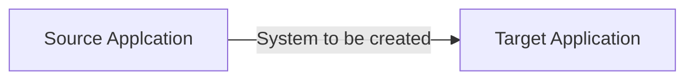

# eventdrivensystem

Solve a problem as described below

We are working on connecting two applications. Let's call them `source` and `target` application.

- Source application wants to call our API every time an event occurs
  - event structure `{ id: '<randomId>', name: 'test event', body: 'test body', timestamp: '<currentTimestamp>' }`
  - source application sends each event only once and requires 2xx response in 500ms. If source application will not receive 2xx response within 500ms then considers that this event delivery has failed and is not resending it again
  - please mock the API calls from the source application

- Target application needs to receive all the events
  - target application is a GraphQL API - please mock API calls to the target application
  - event structure needs to be enhanced by adding `{ brand: 'testBrand' }` as the target application requires it. Mind that this information is not flowing from the source application
  - the target application is rate-limited. In most cases, events from source application are flowing more frequently than the target application is able to consume them. Please make sure the designed solution will take that into consideration

The goal is to create a `system`, to connect above. As shown in the below graph

### Considerations

- System needs to be working in the cloud
- Deployment must be through CI/CD pipeline
- System needs to be secure (authentication)
- System needs to be highly available
- We need to have full visibility on events flowing between `source` and `target` systems
- We need to be able to trace the flow of every single event
- Everything must be covered with tests
- Everything needs to be properly documented, with HLD and LLD included
- System needs to be easy to maintain and support
- All errors/issues need to be visible and handled properly
- We want to see the source code and the working application
- We want to see not only the solution but also how you think and your working process, so please keep all your commits accessible, don't squash them, and use proper naming standards for them

### Required Technology

- Use Node (TypeScript) or GO as a programming language
- Use Terraform to provision the infrastructure
- Use AWS or GCP

### Delivery

If your repository is private, please share it with daniel.rosiak@chalhoub.com and bilal.abdallah@faces.com
