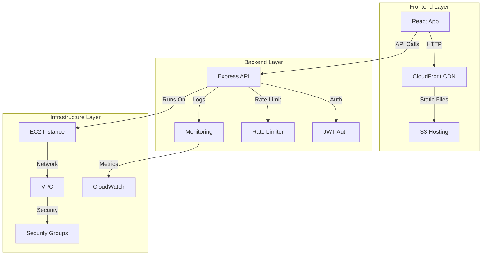
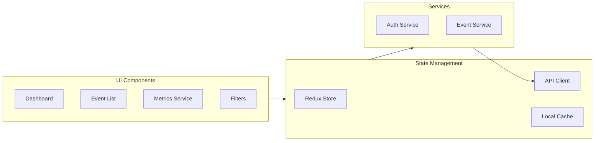
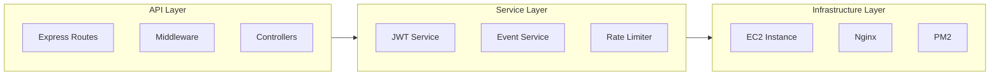
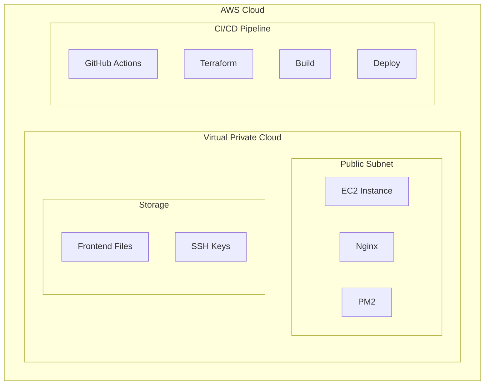
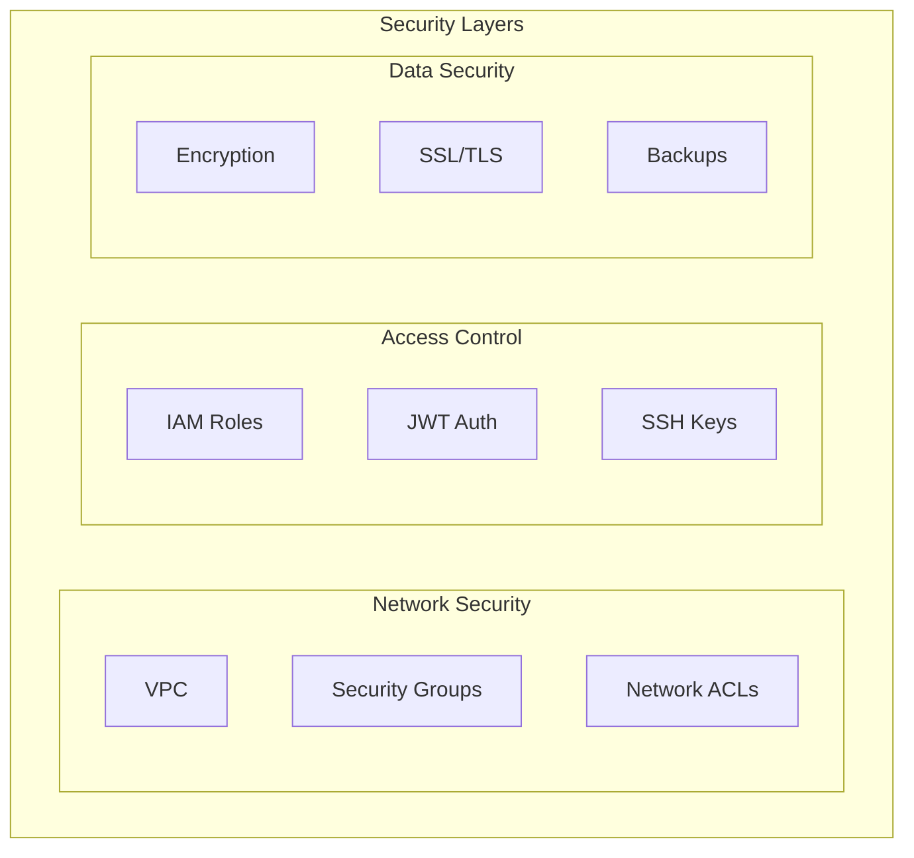

# Event-Driven System Architecture Document

## High-Level Design (HLD)

### System Overview
The system is designed as a scalable, event-driven microservice architecture that handles event processing, transformation, and delivery between source and target applications. The system ensures reliability, security, and observability while maintaining high performance.

### System Components
1. **Frontend Application**
   - React-based event monitoring dashboard
   - Real-time event visualization
   - Event filtering and search
   - Performance metrics display

2. **Backend Service**
   - Node.js/Express API server
   - Event processing and transformation
   - Rate limiting implementation
   - Health monitoring and metrics
   - JWT-based authentication

3. **Infrastructure**
   - AWS EC2 instance for backend
   - S3 bucket for frontend hosting
   - VPC with public subnet
   - Security groups for network isolation
   - CloudWatch for monitoring

### System Architecture Diagram

### Key Features
1. **Reliability**
   - Automated deployment with CI/CD
   - Health check endpoints
   - Error handling and logging
   - Infrastructure as Code (Terraform)

2. **Scalability**
   - Stateless API design
   - Auto-scaling capability
   - Load balancing ready
   - CDN for frontend

3. **Security**
   - JWT-based authentication
   - VPC network isolation
   - Security group rules
   - Encrypted key storage

4. **Monitoring**
   - CloudWatch integration
   - Health check endpoints
   - Performance metrics
   - Error tracking

## Low-Level Design (LLD)

### Component Details

#### 1. Frontend Architecture

#### 2. Backend Architecture

### Data Flow
1. **Frontend Flow**
   - User interacts with React dashboard
   - Redux manages application state
   - API client handles backend communication
   - Services process business logic

2. **Backend Flow**
   - Express handles HTTP requests
   - Middleware processes authentication
   - Controllers manage business logic
   - Services handle core functionality

3. **Infrastructure Flow**
   - Nginx handles reverse proxy
   - PM2 manages Node.js processes
   - CloudWatch collects metrics
   - S3 serves static files

### Technical Specifications

#### Frontend Layer
- Framework: React with TypeScript
- State Management: Redux
- Styling: CSS Modules
- Build Tool: Vite
- Testing: Jest

#### Backend Layer
- Framework: Express.js with TypeScript
- Authentication: JWT
- Process Manager: PM2
- Web Server: Nginx
- Monitoring: CloudWatch

#### Infrastructure Layer
- Compute: EC2 t3.micro
- Storage: S3
- Network: VPC
- Security: Security Groups
- CI/CD: GitHub Actions

### Deployment Architecture

### Infrastructure as Code
1. **Terraform Modules**
   - VPC configuration
   - EC2 instance setup
   - Security groups
   - S3 bucket configuration
   - Key pair management

2. **CI/CD Pipeline**
   - GitHub Actions workflow
   - Automated testing
   - Infrastructure deployment
   - Application deployment
   - Health checks

### Security Architecture

### Monitoring and Observability
1. **Logging**
   - CloudWatch Logs
   - Application logs
   - Access logs
   - Error logs

2. **Metrics**
   - CPU utilization
   - Memory usage
   - Network traffic
   - Application performance

3. **Alerts**
   - Health check failures
   - Error rate thresholds
   - Resource utilization
   - Security events

### Performance Optimization
1. **Frontend**
   - Code splitting
   - Lazy loading
   - Caching
   - CDN distribution

2. **Backend**
   - Nginx caching
   - PM2 clustering
   - Connection pooling
   - Rate limiting

3. **Infrastructure**
   - Auto-scaling
   - Load balancing
   - Caching layers
   - CDN integration

### Maintenance and Support
1. **Monitoring**
   - Health checks
   - Performance metrics
   - Error tracking
   - Resource utilization

2. **Backup and Recovery**
   - Automated backups
   - Disaster recovery
   - State management
   - Key rotation

3. **Documentation**
   - API documentation
   - System architecture
   - Deployment guides
   - Troubleshooting 