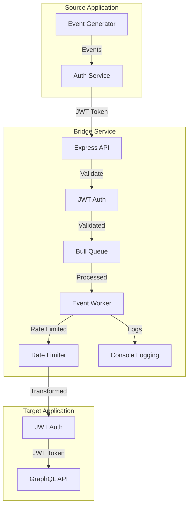
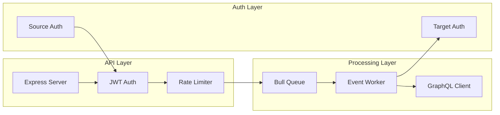
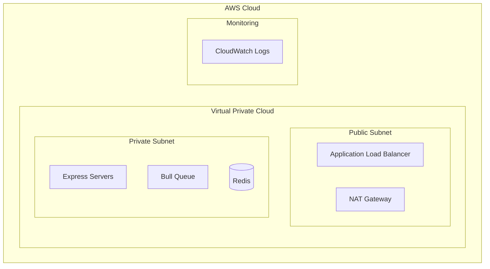

# Event-Driven System Architecture Document

## High-Level Design (HLD)

### System Overview
The system is designed to bridge communication between a source application and a target application, handling event transformation and rate limiting while ensuring reliability and observability.

### System Components
1. **Source Application**
   - Generates events with structure: `{ id, name, body, timestamp }`
   - Requires 500ms response time with 2xx status
   - No retry mechanism
   - Authenticates using JWT tokens

2. **Bridge Service**
   - Core event processing service
   - Handles event transformation
   - Implements rate limiting (5 events per second)
   - Provides monitoring and tracing
   - Uses Bull queue for reliable event processing

3. **Target Application**
   - GraphQL API endpoint
   - Rate-limited consumer
   - Requires enhanced event structure with `brand` field
   - Authenticates bridge service using JWT tokens

### System Architecture Diagram

### Key Features
1. **Reliability**
   - Bull queue for event persistence
   - Error handling with retries
   - Failed job logging
   - Health check endpoint

2. **Scalability**
   - Queue-based processing
   - Rate limiting (5 events/sec)
   - Stateless API design

3. **Security**
   - JWT-based authentication
   - Service-specific tokens
   - Token validation
   - Secure headers

4. **Monitoring**
   - Console logging
   - Event tracking
   - Error logging
   - Health monitoring

## Low-Level Design (LLD)

### Component Details

#### 1. Bridge Service Architecture

### Data Flow
1. **Event Reception**
   - Source application sends event with JWT token
   - Express server validates JWT token
   - Event is validated for required fields
   - Event is queued in Bull queue

2. **Event Processing**
   - Bull queue processes events with rate limiting
   - Worker transforms event (adds brand field)
   - GraphQL client sends to target API
   - Response is logged

3. **Event Delivery**
   - Transformed event is sent to target GraphQL API
   - Bridge service authenticates with JWT
   - Failed events are logged
   - Success/failure status is tracked

### Technical Specifications

#### API Layer
- Framework: Express.js with TypeScript
- Authentication: JWT-based with service-specific tokens
- Rate Limiting: Bull queue limiter (5 events/sec)
- Request Timeout: 500ms
- Health Check: /health endpoint

#### Processing Layer
- Queue System: Bull Queue
- GraphQL Client: graphql-request
- Event Transformation: TypeScript utilities
- Error Handling: Try-catch with logging

#### Authentication Layer
- JWT Service: Custom implementation
- Token Types: Service-specific tokens
- Token Validation: Middleware
- Token Generation: JWTService class

### Monitoring and Observability
1. **Logging**
   - Console logging for events
   - Error logging for failures
   - Job status logging
   - Health check monitoring

2. **Error Tracking**
   - Failed job logging
   - Error message capture
   - Stack trace logging
   - Job retry tracking

### Deployment Architecture

### Infrastructure as Code
- Terraform modules for each component
- AWS provider configuration
- Network topology
- Security groups and IAM roles

### CI/CD Pipeline
1. **Build Stage**
   - TypeScript compilation
   - Unit tests
   - Integration tests

2. **Deploy Stage**
   - Infrastructure deployment
   - Application deployment
   - Health checks

3. **Monitor Stage**
   - Log monitoring
   - Error tracking
   - Health monitoring

### Security Considerations
1. **Authentication**
   - JWT token validation
   - Service-specific tokens
   - Token expiration
   - Secure token storage

2. **Application Security**
   - Input validation
   - Request sanitization
   - Error handling
   - Rate limiting

3. **Network Security**
   - VPC isolation
   - Security groups
   - HTTPS/TLS
   - API Gateway

### Performance Optimization
1. **Queue Management**
   - Bull queue configuration
   - Rate limiting
   - Job prioritization
   - Failed job handling

2. **API Optimization**
   - Response time optimization
   - Connection pooling
   - Request batching
   - Caching strategy

### Maintenance and Support
1. **Monitoring**
   - Health checks
   - Log monitoring
   - Error tracking
   - Performance metrics

2. **Logging**
   - Console logging
   - Error logging
   - Event tracking
   - Job status logging

3. **Documentation**
   - API documentation
   - System documentation
   - Runbooks
   - Troubleshooting guides 